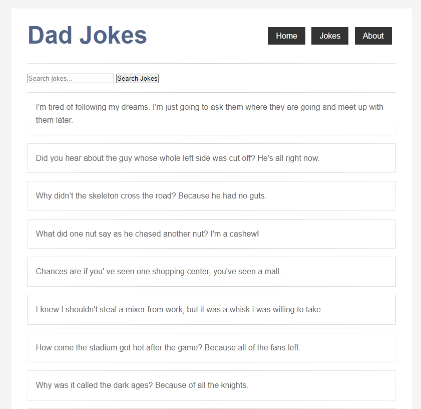

# dadjokes

<p>An app to retrieve some dadjokes from an external API. You can filter jokes by words.</p>

<h1 align="center">
    
</h1>

## Build Setup

```bash
# install dependencies
$ npm install

# serve with hot reload at localhost:3000
$ npm run dev
